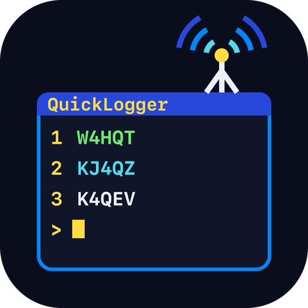
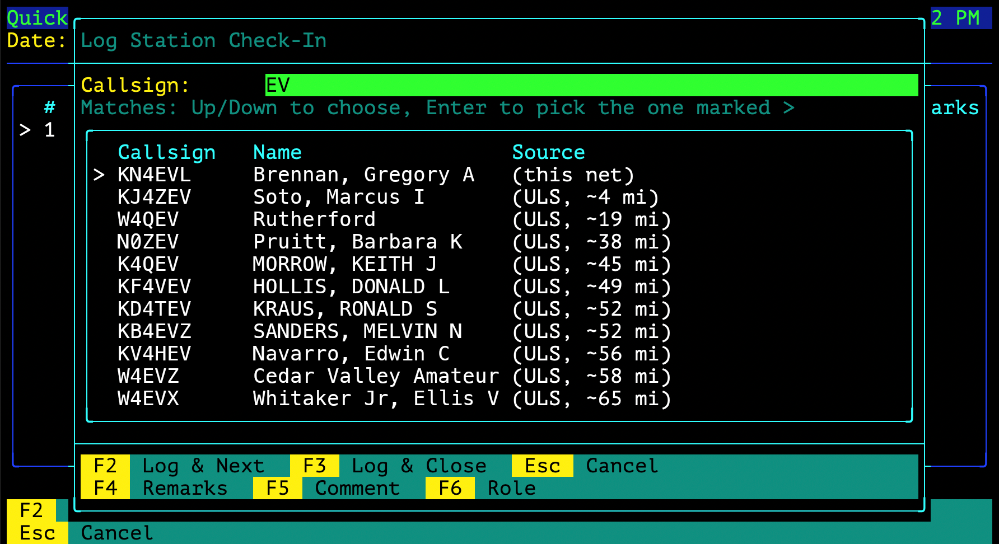
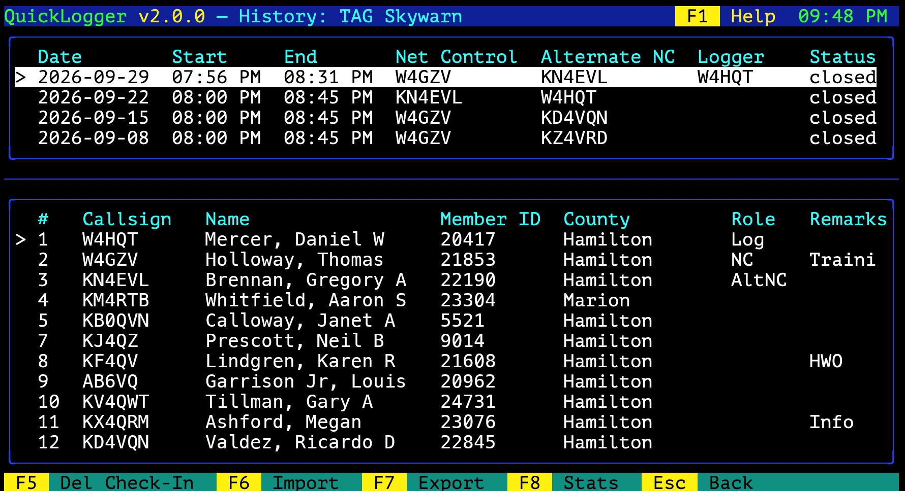

# QuickLogger

[](https://github.com/W4KWK-Projects/QuickLogger/releases/latest)
[](LICENSE)
[](https://github.com/W4KWK-Projects/QuickLogger/actions/workflows/build.yml)

**A free, keystroke-driven net logger for ham radio and GMRS that knows your stations.**

Type a few letters of a callsign and QuickLogger offers the stations your net already knows first, then licensed stations near you, nearest first. Pick one and the name, city, county and grid square fill in on their own. Run it on your own computer, or on one always-on server that your whole group logs into over SSH.





## Why QuickLogger

- **It remembers your regulars.** Every station that checks in is saved to its net. Saved stations come first in autocomplete and carry default remarks ("mobile", "EOC") that fill in at check-in.
- **It finds stations by distance.** Autocomplete adds licensed stations near the net's ZIP or postal code, nearest first with the miles shown, from FCC data (US amateur and GMRS) and ISED data (Canadian amateur). You set the radius.
- **Station details fill themselves in.** Name, address, county and grid square come from the license data and the ZIP code, so a check-in is often just the callsign.
- **Everything is a keystroke.** Every action is on a labeled F-key. No mouse, and nothing to hunt for while the net is running.
- **One shared server, no accounts to manage.** Operators `ssh` straight into the app with their own keys. There are no operating-system accounts to create, and a user can be view-only for observers. Mosh works too, for laptops and phones on bad connections.
- **Your data goes where you need it.** Export a session as a log, as ADIF for your logging program, or as a QuickLogger file for another install. Installs can also push closed sessions to a central server and pull nets back.
- **Free, and GMRS is a first-class citizen.** No cost, and the source is open (GPL v3 only).

## Quick start

1. Download the file for your system from the [latest release](https://github.com/W4KWK-Projects/QuickLogger/releases/latest).
2. Install the libraries it uses and unpack it (below).
3. Run `./QuickLogger` (`QuickLogger.exe` on Windows) from the folder you want its data kept in. It asks for your call sign and ZIP, then downloads the license data on first launch.

<details>
<summary><b>macOS</b> (Apple Silicon, macOS 13+)</summary>

```
brew install libssh
tar xzf QuickLogger-<version>-macos-arm64.tar.gz
xattr -d com.apple.quarantine QuickLogger-<version>-macos-arm64/QuickLogger
```

The `xattr` line is only needed if a web browser downloaded it: the binary isn't signed by an Apple-registered developer.
</details>

<details>
<summary><b>Linux</b> (amd64, arm64)</summary>

```
sudo apt install libssh-4 libcurl4t64 libsqlite3-0
tar xzf QuickLogger-<version>-linux-amd64.tar.gz
```

That's for Debian 13 and Ubuntu 24.04 and newer. For Debian 12, Ubuntu 22.04 and Fedora, see [Installing QuickLogger](docs/INSTALL.md#download-linux).
</details>

<details>
<summary><b>FreeBSD</b> 15 (amd64, arm64)</summary>

```
sudo pkg install libssh curl sqlite3
tar xzf QuickLogger-<version>-freebsd-amd64.tar.gz
```
</details>

<details>
<summary><b>Windows</b> (x64, arm64)</summary>

Unzip it and run `QuickLogger.exe` from Windows Terminal. Nothing else to install. It isn't signed, so SmartScreen may stop it the first time: choose **More info**, then **Run anyway**.

The Windows build is console only, with no SSH server. To host a shared net, run it on macOS, Linux or FreeBSD, or in WSL2.
</details>

Other systems can [build it from source](docs/BUILDING.md). Every download has a `.sha256` file to check it against.

## What do you want to do?

- **Run a net on my own computer:** [Installing QuickLogger](docs/INSTALL.md), then the [User Guide](docs/USER_GUIDE.md).
- **Host a shared net for my group:** the [Shared server guide](docs/SHARED_SERVER.md) for the administrator, and [Connecting](docs/CONNECTING.md) for the operators who log in. To make a server install each new release by itself, see [deploy/linux](deploy/linux/README.md) or [deploy/freebsd](deploy/freebsd/README.md).
- **Build from source:** [Building QuickLogger](docs/BUILDING.md).

## Supported platforms

| Platform | Support | Verified |
|---|---|---|
| **macOS** (Apple Silicon) | Full (console + SSH server) | Built and run natively |
| **Linux** (glibc and musl) | Full; no ZMODEM on Alpine | Built and fully tested on every change on Ubuntu, Debian, Fedora and Alpine |
| **FreeBSD** 14 / 15 | Full | Built and fully tested on FreeBSD 15 for every release |
| **Windows** | Console only: no SSH server, no ZMODEM | Built and fully tested for every release |

Release binaries for every platform have also been run on real systems. The details are in [Installing QuickLogger](docs/INSTALL.md#supported-platforms-and-how-well-verified).

## Documentation

- [User Guide](docs/USER_GUIDE.md): running a net, check-ins, autocomplete, saved stations, History, exports and imports.
- [Installing QuickLogger](docs/INSTALL.md): downloads, libraries per platform, optional `lrzsz` and `mosh`, first launch, the files it creates.
- [Shared server](docs/SHARED_SERVER.md): the built-in SSH server, adding and managing users, view-only users, flags, networking, the host key.
- [Connecting to a shared QuickLogger](docs/CONNECTING.md): creating an SSH key, compression, keepalives, Mosh.
- [Building QuickLogger](docs/BUILDING.md): requirements, build steps and options, offline builds, tests.
- [Sizing](docs/SIZING.md): disk space, memory and backups.
- [Upstream commands](docs/IMPORT_SESSION.md): the commands a server answers, for people writing their own clients.
- [Version numbers](docs/VERSIONING.md).

## License and help

QuickLogger is free software under version 3 of the [GNU General Public License](LICENSE) only, not any later version (SPDX: `GPL-3.0-only`).

Found a bug, or want something added? [Open an issue](https://github.com/W4KWK-Projects/QuickLogger/issues).

## Moved sections

Links to these old README sections land here.

### Running QuickLogger

Moved to [Installing QuickLogger](docs/INSTALL.md).

### Building QuickLogger

Moved to [Building QuickLogger](docs/BUILDING.md).

### Built-in SSH server

Moved to the [Shared server guide](docs/SHARED_SERVER.md) and [Connecting](docs/CONNECTING.md).
