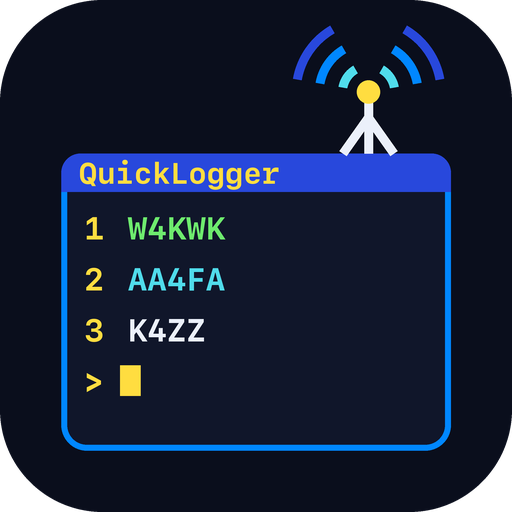

# QuickLogger User Guide

How to use QuickLogger once it's running. For downloading, installing, building and setting up the built-in SSH server, see the [README](../README.md).

1. [The screen and the keys](#the-screen-and-the-keys)
2. [Settings](#settings)
3. [Recurring nets](#recurring-nets)
4. [Running a net](#running-a-net)
5. [Sharing a session](#sharing-a-session)
6. [Ad hoc nets](#ad-hoc-nets)
7. [History](#history)
8. [Editing and deleting by number](#editing-and-deleting-by-number)
9. [Callsign autocomplete](#callsign-autocomplete)
10. [Saved stations](#saved-stations)
11. [Help and seldom-used keys](#help-and-seldom-used-keys)
12. [Exporting and importing](#exporting-and-importing)
13. [Wider terminals](#wider-terminals)
14. [Station data](#station-data)
15. [Tips and troubleshooting](#tips-and-troubleshooting)

## The screen and the keys

Every page has a **top bar** (the page's name, **F1 Help** and the clock; while you're on a net, its check-in count too) and a **key bar** at the bottom listing what each key does there. QuickLogger is run entirely from the keyboard; there's no mouse.

- **F2** is the page's main action (New, Save, Check In…), **Esc** goes back or cancels, and the other F-keys do what the key bar says.
- **Tab**, **Up** and **Down** move between fields; **Enter** picks the highlighted item in a list.
- **F1** on any page explains every key the page has.
- A **red** line under a form says why something wasn't done; a **green** one confirms what was.

On first run you're taken straight to Settings, since a callsign and home ZIP are required. After that you start on the **Recurring Nets** list. **F10** there quits.

## Settings

**F4** on Recurring Nets.

| Field | What it's for |
|---|---|
| My Callsign | Your callsign, filled in when you start a net |
| My ZIP Code | Your home ZIP. Nearby-station autocomplete measures distance from it when a net has no ZIP of its own. |
| Time Format | 12-hour (3:42 PM, the default) or 24-hour (15:42), for every time shown or exported. **Left/Right** change it. |

**F2** saves. Each SSH user has their own settings. Times are shown in the time zone of the computer QuickLogger runs on. At the local console only, **F3** refreshes the station data now and **F4** opens Manage Users (see the README's SSH section).

## Recurring nets

A recurring net is one you run again and again: a weekly Skywarn net, a club's Tuesday net. Its sessions and check-ins build up its history, and the stations that check in are remembered for autocomplete.

- **Create:** **F2** on Recurring Nets. Only the name is required; Mode, Frequency, ZIP Code (5 digits) and Recurrence ("Tuesdays 8pm ET") are optional. A net's ZIP centers nearby-station autocomplete on where the net meets.
- **Edit:** **F7**, then the net's number. **F2** saves and returns to the list.
- **Delete:** **F8** on its Edit Net page. It asks first: this deletes every session and check-in of the net.
- **Telling nets apart:** the list shows when each net was created, or when it was imported, and *session open* while one of its sessions hasn't been closed. The list keeps this current as others open and close sessions.

## Running a net

1. Highlight the net and press **F3** (or Enter).
2. Choose your **role**: Net Control, Alternate Net Control or Logger. (**Viewer** is for watching a session that's already open; see [Sharing a session](#sharing-a-session).)

If the net already has a session open, the list says *session open*, a line under the list says so when it's highlighted, and the key bar reads **F3/Enter Join** instead of Start. Press it anyway: you're asked what to do (see [Sharing a session](#sharing-a-session)).
3. Confirm your callsign (it's filled in from Settings) and press **F2**. You're logged as check-in #1, in your role.

**F2** opens the **New Check-In** window. Type the callsign (see [autocomplete](#callsign-autocomplete)) and fill in whatever else you have:

| Field | Notes |
|---|---|
| Callsign | Required; US or Canadian only |
| Name, Member ID, Street Addr, City, County, State, Zip, Grid Square | The station's details, kept for next time. County fills in from the ZIP. |
| Signal Report, Remarks, Comment | This check-in only. Remarks start out as the station's default remarks for this net, and whatever you log becomes its new default. |
| Additional Role | Gives this station one of the session's other roles (the ones you don't hold yourself). Only one station holds each role; giving it to another moves it. |

In the window, **F2** logs and clears the form for the next station, **F3** logs and closes, and **Esc** closes without logging. A station can check in only once per session, counting a mobile or portable callsign (`W4KWK/M`, `VE3/W4KWK`) as the same station; logging it again says which # it already is.

On the check-in list, **F3** edits and **F5** deletes a check-in by its number (see [Editing and deleting by number](#editing-and-deleting-by-number)); **Enter** edits the highlighted one. A check-in's callsign can't be changed; delete it and log it again instead. Deleting leaves a gap in the numbers rather than renumbering the rest. **F7** exports the log.

**F4** closes the session when the net is over. It asks first, since a closed session can't be reopened for logging; it moves to [History](#history).

## Sharing a session

Several operators can log the same session at once (over SSH), for example a Net Control and a Logger.

- **Is a session open?** On Recurring Nets, a net being logged right now shows *session open*, and when it's highlighted the key bar reads **F3/Enter Join**.
- **Joining or watching:** highlight the net and press **F3** (or Enter), the same key that starts a net. Because a session is open, QuickLogger asks what you want to do:
  - **F2/Enter Resume:** log check-ins in the same session, alongside the others.
  - **F4 View:** only watch it. You can't change anything.
  - **F3 Close & New:** close that session and start a new one. Don't use this to join someone else's net.
- **Watching:** a **Viewer** (F4 above, or Viewer on the role page) sees the session as it's logged, and can export it and use the look-up keys (F6, F8, F9, F10), but can't log, edit, delete or close anything. **Esc** leaves, and the session carries on.
- **Staying in step:** check-ins anyone logs appear on everyone's screen within a few seconds.
- **When someone closes it:** the others can't log to it any more. Their next check-in is refused with a message naming the callsign that wasn't logged, and they're returned to the net list.
- **Dropped connections:** a session left open by a dropped connection or closed terminal is resumed the same way.

## Ad hoc nets

**F5** on Recurring Nets starts a one-off net: fill in its name (and anything else) and press **F2**. It runs exactly like a recurring net but never appears in the Recurring Nets list. Everything else about ad hoc nets is on this page:

- **F3** resumes an ad hoc session left open (by number), such as after a dropped connection.
- **F6** shows the history of every ad hoc net, one session per row, with the net's name.

## History

**F6** on Recurring Nets shows the highlighted net's past sessions: when each started and ended, its roles, its number of check-ins (on a wide enough terminal) and whether it's still open. The bottom list shows the check-ins of the highlighted session.

- **Up/Down** choose a session.
- **F7** exports the highlighted session's log.
- **F4** deletes one check-in from that session (by its #). If it held a role, the role is cleared too.
- **F5** deletes a whole closed session (by number). An open session has to be resumed and closed first.

## Editing and deleting by number

Edit and delete keys ask which row you mean: every row gets a number, you type it and press **Enter**. An edit opens the row straight away; a delete shows what it's about to remove and asks you to confirm with **F2/Enter** (**Esc** backs out). While choosing, **Up/Down** move the highlight (Enter with no number picks it), **Backspace** erases a digit and **Esc** cancels. Check-ins use the number in their **#** column.

| Page | Key | Picks a row to… |
|---|---|---|
| Recurring Nets | F7 | Edit a net |
| Ad Hoc Net | F3 | Resume an open ad hoc session |
| Active net | F3 / F5 | Edit / delete a check-in |
| Active net | F6 / F9 | See a station's history / card |
| Edit Net | F9 / F4 | Edit / remove a saved station |
| History | F4 / F5 | Delete a check-in / a closed session |
| Manage Users | F3 | Remove an SSH user |

**A station's details are kept while anything uses them:** a net it's saved to, or a check-in in any log. When the last of those goes, its details go too, and it stops coming up in autocomplete; that's how a mistyped callsign gets cleaned up. The delete confirmation says which will happen.

## Callsign autocomplete

In the New Check-In and Saved Station windows, matches appear as you type any part of a callsign, in either case (`kwk` finds W4KWK). Up to 8 are shown, in this order:

1. Stations known to **this net** (checked in before, or saved to it), marked *(this net)*.
2. Stations known to **other nets**, marked *(other net)*.
3. **Licensed stations nearby**, from the FCC data: within about 70 miles of the net's ZIP (or your home ZIP), nearest first, marked *(ULS, ~N mi)*. Stations whose ZIP has no location on file (usually a PO Box) follow, marked *(ULS, nearby)*.

**Up/Down** move the **>** marker and **Enter** picks that match, filling in the station's details. You stay in the Callsign field, so you can keep typing to narrow the list. While it's showing, the list takes the place of the window's other fields; they come back when you pick a match, clear the callsign or **Tab** away. If nothing matches, type the whole callsign: **Enter** then looks it up exactly, in the FCC data at any distance.

**Callsign rules:** only callsigns the US or Canada could issue are accepted, with or without a portable indicator (`W4KWK/M`, `/P`, `/QRP`, `/4`, `VE3/W4KWK`). Anything else, like a typo (`W4KW4`) or a foreign callsign, is refused when you log or save it.

## Saved stations

A net's saved stations are the ones it expects: they come first in its autocomplete, and each can have **default remarks** ("mobile", "EOC") filled in when it checks in. Every station that checks in is saved to the net automatically.

On **Edit Net** (**F7** on Recurring Nets), the net's details sit above its saved stations.

- **F6** opens the Saved Station window for a new station, **F9** (by number) or **Enter** for an existing one. In the window, **F2** saves and clears it for the next station, **F3** saves and closes, **Esc** closes without saving.
- **F4** removes a station from the net (by number).
- **F7** exports the list.

## Help and seldom-used keys

**F1** opens Help on any page. (A Viewer's Help lists only what a Viewer can do.) Some pages also have keys for things you won't need often. They always work, but they appear on the key bar only when there's room; Help lists them, marked with an asterisk. Each opens a window: **Up/Down** scroll it, **Esc** closes it. "By #" means it asks for a check-in's number first.

| Page | Key | What it shows |
|---|---|---|
| Active net | F6 | A station's other check-ins to this net (by #) |
| Active net | F8 | Regulars not yet heard: stations in at least half of the net's last 10 sessions (or of all of them, if fewer) who haven't checked in yet. **Enter** opens New Check-In with the highlighted one filled in. |
| Active net | F9 | Everything known about a station (by #): address, license class, check-in totals, the nets it's saved to |
| Active net | F10 | This session so far: check-ins, first-timers, and the recent average |
| History | F8 | The net's statistics: sessions, averages, busiest session, recent months, most frequent stations |
| History | F9 | Find a station: its check-ins to every net |
| Edit Net | F5 | Saved stations that haven't checked in to this net for six months, or ever |

## Exporting and importing

Exports are written to the `exports/` folder next to QuickLogger's database; imports are read from `imports/`.

| What | Key | File |
|---|---|---|
| A session's log | F7 on the active net or History | `NetName_date_log.txt` |
| A net's saved stations | F7 on Edit Net | `NetName_saved_stations.txt` |
| A whole net, to share | F8 on Recurring Nets | `NetName.qlnet`: the net, its saved stations and its full history |

**Importing a net:** put the `.qlnet` file in `imports/` (or receive it with **F3**, below), press **F9** on Recurring Nets, highlight the file and press **F2**. It's added as a new net marked *imported*, so it can't overwrite one of yours.

**Over SSH (ZMODEM):** after an export, QuickLogger offers to send the file to your terminal. Open your terminal's receive window, then press **Enter**; **Esc** skips it and the file stays in `exports/`. To upload a `.qlnet`, press **F3** on the Import page, then send the file from your terminal. This needs a terminal that supports ZMODEM (such as ZOC or SecureCRT) and `lrzsz` installed where QuickLogger runs.

**File format:** exported logs and saved-station lists are plain text in a fixed format, the same whatever terminal they came from, so a program can read them by column position. A few header lines come first (the net's name and, for a log, its date, times, roles and status), then a blank line, a column-heading line and one line per check-in or station. Each column starts two spaces after the one before; longer values are cut to fit, and trailing spaces are dropped.

| Log column | Width | | Saved-station column | Width |
|---|---|---|---|---|
| # | 4 | | Callsign | 13 |
| Time | 8 | | Name | 30 |
| Callsign | 13 | | Member ID | 10 |
| Name | 30 | | City, State | 30 |
| Member ID | 10 | | County | 20 |
| City, State | 30 | | Grid | 8 |
| County | 20 | | Default Remarks | 40 |
| Role | 6 | | | |
| Signal | 6 | | | |
| Remarks | 40 | | | |
| Comment | 60 | | | |

## Wider terminals

Everything fits an 80×24 terminal. A wider one gets more:

- **Lists** widen their columns and add more: check-ins gain the time, city and state, signal report and comment; the net list shows each net's mode, frequency and schedule; History shows each session's check-in count; saved stations add city, county, grid and default remarks; autocomplete matches add city, state and county. Once every column fits, the gaps between them widen.
- **Forms** (Edit Net and the check-in and Saved Station windows) put their fields in two columns from 90 columns up, without changing the Tab order.
- **Windows** opened with the seldom-used keys widen their tables too.

Resizing the terminal re-lays everything out at once. At 80 columns everything looks as it always has.

## Station data

QuickLogger keeps its own copy of the FCC's amateur license database, plus Census data for working out counties, and keeps it current by itself:

- The first download starts when QuickLogger first runs and takes a minute or two. Until it's done, a yellow **Loading station data NN%** notice shows at the top of every screen and callsign lookups find no one; everything else works.
- After that, the FCC data is refreshed about weekly (**Updating station data** shows meanwhile; lookups keep working). A failed download is retried hourly.
- **Settings** shows when the data was last updated.

**County:** FCC records have no county, so QuickLogger uses the station's ZIP. For a ZIP that crosses a county line, the station's city decides when it names a town inside that ZIP; otherwise the ZIP counts as being in whichever county most of its residents live in.

## Tips and troubleshooting

- **An F-key does nothing, or does something else:** some terminal programs keep certain F-keys for themselves (F1 for their own help, F10 for their menu, F11 for full screen). Turn that off in the terminal's settings, or see its keyboard options.
- **The screen is cut off:** QuickLogger needs at least 80×24. Make the window bigger; it adjusts straight away.
- **Esc takes a moment:** about a tenth of a second, while QuickLogger checks that it isn't the start of another key. Pressing Esc twice quickly works as two Escs.
- **A callsign isn't found:** check whether the station data is still loading (the notice at the top). FCC records only cover US licensees; enter Canadian and other stations' details by hand.
- **"Closed by someone else":** another operator closed the session you were logging. Start the net again (F3) for a new session.
